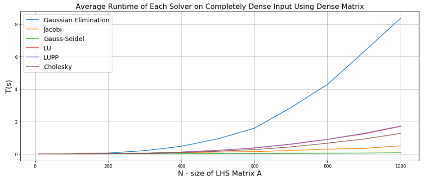
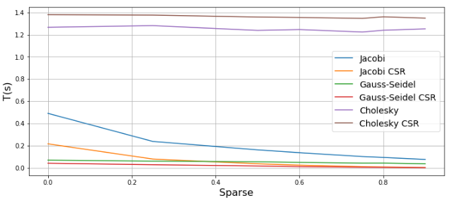
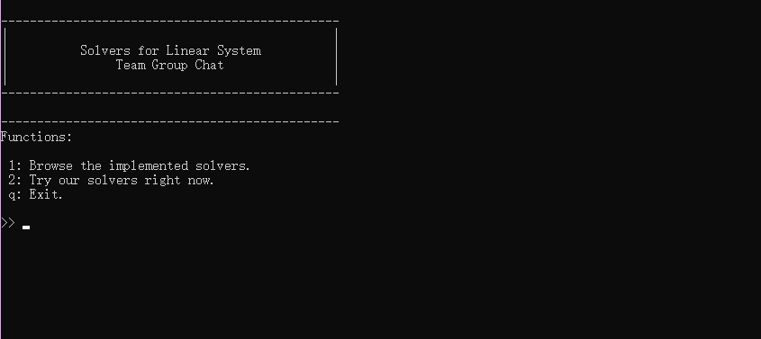
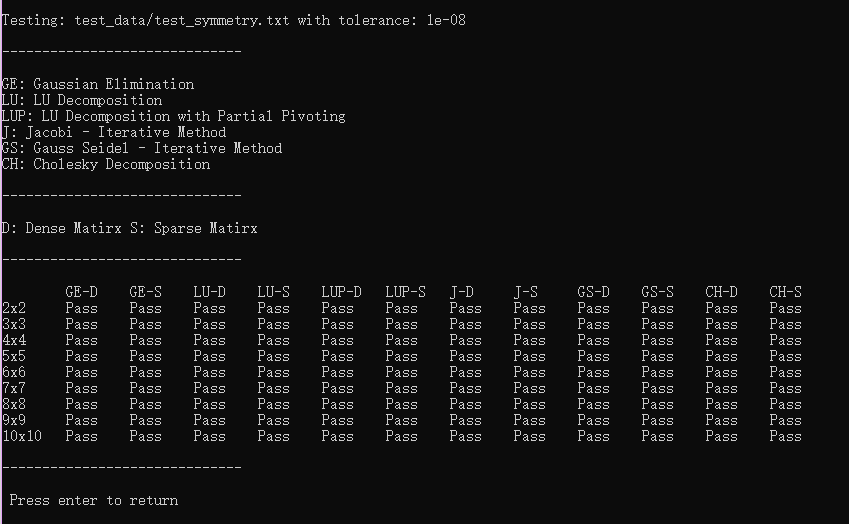
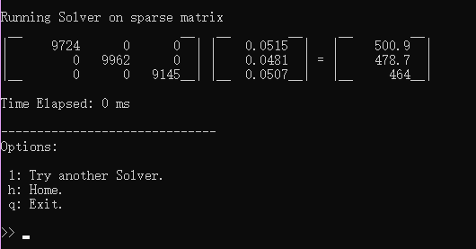
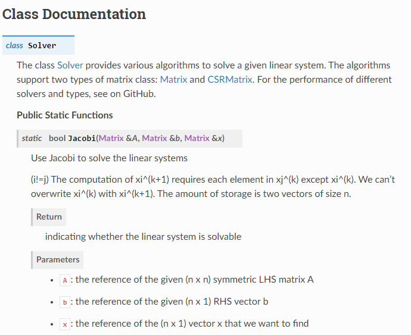

# ACSE-5 Assignment - Linear Solvers


* Team: Group Chat

* Author: Qian Chen, Jin Yitong, Wang Jiaruijue

* Email: cq419@ic.ac.uk, yj319@ic.ac.uk, jw919@ic.ac.uk


## Overview

Six algorithms are implemented to solve the linear system Ax=b, where A is a positive definite matrix, and x and b are both vectors using C-plus-plus. Analysis of accuracy and performance is conducted and a user-friendly interface is provided. 

Check our brief Report: [Implementing Linear Solvers using C-plus-plus](https://github.com/acse-2019/acse-5-assignment-group-chat/blob/master/Brief%20Report%20-%20Team%20Group%20Chat%20-%20Final.pdf)

## Implemented Solvers

* [Gaussian Elimination](https://en.wikipedia.org/wiki/Gaussian_elimination) (ACSE-3 Lecture 3)
* [LU Decomposition](https://en.wikipedia.org/wiki/LU_decomposition) (ACSE-3 Lecture 3)
* [LU Decomposition with Partial Pivoting](https://en.wikipedia.org/wiki/Pivot_element) (ACSE-3 Lecture 3)
* [Jacobi Method](https://en.wikipedia.org/wiki/Jacobi_method) (ACSE-3 Lecture 3)
* [Gauss-Seidel Method](https://en.wikipedia.org/wiki/Gauss–Seidel_method) (ACSE-3 Lecture 3)
* [Cholesky Decomposition](https://en.wikipedia.org/wiki/Cholesky_decomposition) 

## Matrix

Our Implementation of class Matrix is derived from the Matrix libraries constructed in class, which provides various necessary operations such as matrix multiplication, inversion and so on. 




**Besides, the class CSRMatrix is well designed to inherit the class Matrix and implemented the compressed sparse matrix concept using a singly linked list.**

*Performance Improvement using CSRMatrix*



## User Interface

We implemented a terminal application to run the linear solvers. 



**Users can run pre\-stored test files to test whether the solvers are running normally.** The file format is described [here](https://github.com/acse-2019/acse-5-assignment-group-chat/blob/master/LinearSolver/test_data/Instruction%20for%20test%20file.pdf).



Besides, **users can choose different solvers to solve the linear systems in either dense or sparse mode**, input through three ways, random generation and standard input. The result will be directly printed to standard output and the application does not support any file stream output for safety concerns.




## Documentation

Download the folder [docs](https://github.com/acse-2019/acse-5-assignment-group-chat/tree/master/docs) and run the `index.html` file. The documents are generated by [Sphinx](https://www.sphinx-doc.org/en/master/) using the output of [Doxygen](http://www.doxygen.nl/). Below is an example.





## Setup

You can directly compile the `*.h` and `*.cpp` files and execute the binary output file.

```bash
cd LinearSolver
g++ main.cpp Matrix.h CSRMatrix.h Solver.h Interface.h Matrix.cpp CSRMatrix.cpp Solver.cpp Interface.cpp --std=c++11
```

or, you can double click the `LinearSolver.sln` to start the project in Microsoft Visual Studio.

